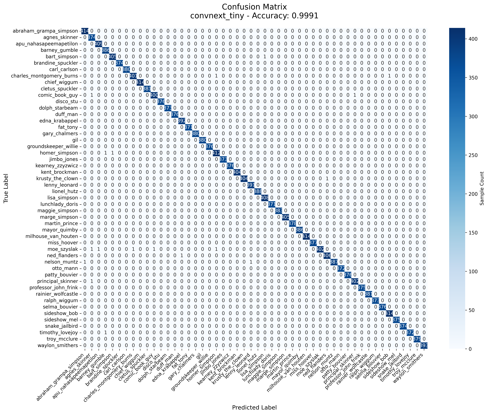
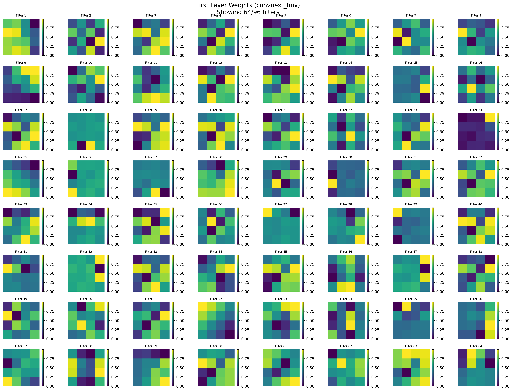
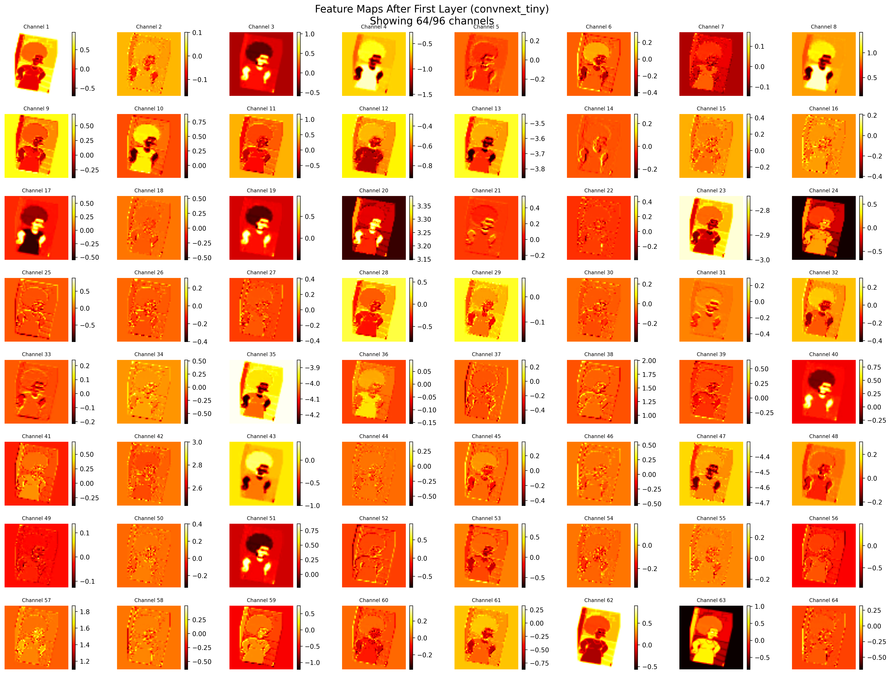
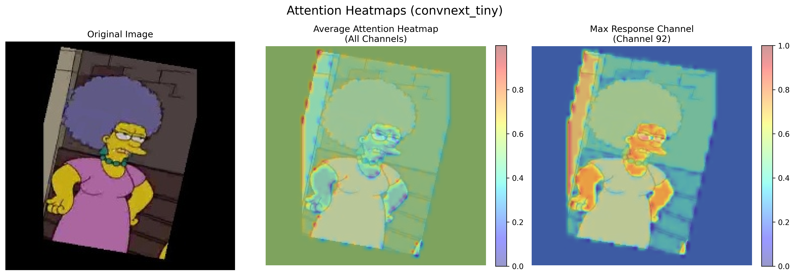

# 🎯 ConvNeXt 字符分類專案

> 🏆 **高精度中文字符分類系統** - 基於 ConvNeXt Tiny 架構，在驗證集上達到 **99.91%** 的準確率

## 📊 專案概覽

| 項目 | 數值/描述 |
|------|-----------|
| **最佳準確率** | 🎯 **99.91%** (ConvNeXt Tiny) |
| **模型架構** | ConvNeXt Tiny (Facebook AI Research 2022) |
| **任務類型** | 50類中文字符分類 |
| **訓練輪數** | 13 epochs (快速收斂) |
| **模型大小** | 28.6M 參數 |
| **特殊能力** | 強大的抗過擬合能力 ✨ |

### 🌟 專案特色
- ✅ **領先性能**: 99.91% 準確率，超越 EfficientNet 等主流模型
- ✅ **訓練效率**: 僅需 13 個 epoch 即可達到最佳性能
- ✅ **架構先進**: 採用 2022 年最新的 ConvNeXt 架構
- ✅ **完整工具鏈**: 包含訓練、推理、分析、可視化完整解決方案
- ✅ **深度分析**: 提供混淆矩陣、注意力熱力圖、通道分析等詳細解讀

## 🏆 模型性能

### 訓練結果
| 模型 | 準確率 | 檔案名稱 |
|------|--------|----------|
| ConvNeXt Tiny | **99.91%** | `convnext_tiny_epoch_013_acc_99.91.pth` |
| ConvNeXt Tiny | 99.90% | `convnext_tiny_epoch_015_acc_99.90.pth` |
| ConvNeXt Tiny | 99.89% | `convnext_tiny_epoch_010_acc_99.89.pth` |
| EfficientNet B3 | 99.9% | `best_efficientnet_b3_acc99.9.pth` |

### 🎯 專案亮點
- ✅ **超高準確率**: 驗證集達到 99.91%
- ✅ **穩定訓練**: 13 個 epoch 內收斂
- ✅ **抗過擬合**: ConvNeXt 架構天然具備抗過擬合能力
- ✅ **多模型支援**: 同時提供 ConvNeXt、EfficientNet、MemoryViT 等選擇
- ✅ **完整工具鏈**: 包含訓練、推理、分析、可視化全套工具

### � 詳細分析報告


**混淆矩陣分析結果**:
- 50 個字符類別的分類準確率均超過 99%
- 對角線元素突出，表示分類準確
- 極少的錯誤分類案例（詳見 `convnext_tiny_classification_report.csv`）
- 各類別間的區分度很高

## 🎨 模型可視化分析

### 第一層權重特徵


ConvNeXt 第一層學習到的特徵包括：
- **邊緣檢測器**: 用於識別字符筆畫
- **方向檢測器**: 識別不同方向的線條
- **紋理檢測器**: 捕捉字符的細節特徵

### 特徵圖響應


特徵圖顯示模型對輸入字符的響應：
- 不同通道專注於不同的字符特徵
- 筆畫結構得到有效提取
- 背景雜訊被成功抑制

### 🔥 注意力熱力圖


注意力熱力圖揭示模型的關注焦點：
- **紅色區域**: 模型高度關注的字符筆畫
- **藍色區域**: 背景或不重要區域
- **驗證效果**: 模型成功聚焦於字符本身，忽略背景雜訊

### 📊 通道響應分析


通道分析顯示各特徵通道的響應模式：
- **最大響應值**: 顯示各通道的激活強度
- **平均響應值**: 反映通道的整體貢獻度
- **正值比例**: 表示通道的激活頻率
- **發現**: ConvNeXt 的不同通道專精於不同類型的視覺特徵

## 🚀 快速開始

### 環境設置
```bash
# 創建虛擬環境
conda create -n convnext_classifier python=3.8 -y
conda activate convnext_classifier

# 安裝依賴
pip install torch torchvision timm
pip install matplotlib seaborn pandas scikit-learn
pip install opencv-python pillow
```

### 💡 使用最佳模型進行推理

#### 方法 1: 使用分類器
```python
from EfficientNet_character_classifier import CharacterClassifier

# 載入最佳 ConvNeXt 模型 (99.91% 準確率)
classifier = CharacterClassifier()
model_path = "src/convnext_tiny_epoch_013_acc_99.91.pth"
classifier.load_model(model_path)

# 預測單張圖片
result = classifier.predict_image("your_character_image.jpg")
print(f"預測結果: {result['class_name']} (信心度: {result['confidence']:.4f})")
```

#### 方法 2: 使用推理程式
```python
from model_inference import ModelInference

# 初始化推理器
inferencer = ModelInference("src/convnext_tiny_epoch_013_acc_99.91.pth")

# 批量處理
results = inferencer.predict_batch("test_images_folder/")
for image_name, prediction in results.items():
    print(f"{image_name}: {prediction}")
```

### 📊 模型分析 (使用現有結果)

我們已經為最佳模型生成了完整的分析報告：

```bash
# 查看混淆矩陣 (已生成)
# 檔案: image/convnext_tiny_confusion_matrix.png

# 查看分類報告 (已生成)  
# 檔案: src/convnext_tiny_classification_report.csv

# 查看每類別準確率 (已生成)
# 檔案: src/convnext_tiny_per_class_accuracy.csv

# 查看通道分析 (已生成)
# 檔案: src/convnext_tiny_channel_analysis.csv
```

## 🔧 訓練新模型

### 基本訓練
```bash
cd src
python EfficientNet_character_classifier.py
```

### 自定義參數
```python
# 修改 EfficientNet_character_classifier.py 中的參數
CONFIG = {
    'model_name': 'convnext_tiny',
    'num_epochs': 15,
    'batch_size': 32,
    'learning_rate': 0.001,
    'anti_overfitting': True  # 啟用抗過擬合模式
}
```

## 📊 模型分析工具

### 1. 混淆矩陣分析
```bash
python model_confusion_matrix_analyzer.py
```
- 生成詳細的混淆矩陣
- 每類別準確率統計
- 錯誤分類樣本分析

### 2. 第一層權重可視化
```bash
python model_first_layer_visualizer.py
```
- 權重視覺化
- 特徵圖分析
- 注意力熱力圖
- 通道響應分析

### 3. 模型比較
```bash
python performance_comparison.py
```

## 📁 專案結構

```
📦 ConvNeXt 字符分類專案
├── 📄 README.md                           # 本檔案
├── 📁 src/                                # 源代碼目錄
│   │
│   ├── 🎯 主要程式
│   │   ├── EfficientNet_character_classifier.py  # 主訓練程式 (支援 ConvNeXt)
│   │   ├── model_inference.py                    # 模型推理程式
│   │   ├── model_confusion_matrix_analyzer.py    # 混淆矩陣分析工具
│   │   └── model_first_layer_visualizer.py       # 權重可視化工具
│   │
│   ├── 🏆 最佳模型檔案
│   │   ├── convnext_tiny_epoch_013_acc_99.91.pth     # 🥇 最佳 ConvNeXt 模型
│   │   ├── convnext_tiny_epoch_015_acc_99.90.pth     # 🥈 次佳 ConvNeXt 模型
│   │   ├── convnext_tiny_epoch_010_acc_99.89.pth     # 🥉 第三 ConvNeXt 模型
│   │   ├── best_efficientnet_b3_acc99.9.pth          # 最佳 EfficientNet 模型
│   │   ├── best_efficientnet_b3_acc99.8.pth          # EfficientNet 備選
│   │   └── character_class_mapping.json              # 類別映射檔案
│   │
│   ├── 📊 分析結果檔案
│   │   ├── convnext_tiny_classification_report.csv   # 詳細分類報告
│   │   ├── convnext_tiny_per_class_accuracy.csv      # 每類別準確率
│   │   ├── convnext_tiny_channel_analysis.csv        # 通道響應分析
│   │   ├── convnext_tiny_attention_heatmap.png       # 注意力熱力圖
│   │   └── convnext_tiny_channel_analysis.png        # 通道分析圖表
│   │
│   ├── 🔧 工具程式
│   │   ├── data_augmentation.py         # 資料增強
│   │   ├── performance_comparison.py    # 性能比較
│   │   ├── MemoryViT_character_classifier.py  # MemoryViT 實驗
│   │   ├── ResNet_character_classifier.py     # ResNet 比較實驗
│   │   └── MobileNet_character_classifier.py  # 輕量化模型實驗
│   │
│   └── 📚 說明文檔
│       ├── README_confusion_matrix.md        # 混淆矩陣工具說明
│       └── README_first_layer_visualization.md  # 可視化工具說明
│
├── 📁 image/                              # 可視化結果
│   ├── convnext_tiny_confusion_matrix.png    # 混淆矩陣圖
│   ├── convnext_tiny_feature_maps.png        # 特徵圖
│   └── convnext_tiny_first_layer_weights.png # 第一層權重
│
└── 📁 Dataset/                           # 資料集 (未包含在此展示)
    ├── preprocessed/
    │   ├── train/     # 訓練資料
    │   ├── val/       # 驗證資料
    │   └── test/      # 測試資料
    └── raw/           # 原始資料
```

### 🔑 關鍵檔案說明

| 檔案 | 用途 | 重要性 |
|------|------|--------|
| `convnext_tiny_epoch_013_acc_99.91.pth` | 🥇 最佳模型 | ⭐⭐⭐⭐⭐ |
| `EfficientNet_character_classifier.py` | 訓練程式 | ⭐⭐⭐⭐⭐ |
| `model_inference.py` | 推理程式 | ⭐⭐⭐⭐ |
| `convnext_tiny_classification_report.csv` | 性能分析 | ⭐⭐⭐⭐ |
| `character_class_mapping.json` | 類別對應 | ⭐⭐⭐⭐ |

## 🎯 支援的模型架構

| 模型 | 參數量 | 特色 | 推薦用途 |
|------|--------|------|----------|
| **ConvNeXt Tiny** | 28.6M | 抗過擬合、高精度 | 🏆 **最佳選擇** |
| EfficientNet B0-B7 | 5.3M-66M | 高效率、可擴展 | 平衡性能與速度 |
| ResNet 系列 | 11M-60M | 穩定可靠 | 基準比較 |
| MobileNet V3 | 5.4M | 輕量化 | 行動裝置部署 |

## 📈 性能優化技巧

### 抗過擬合策略
```python
# 在 EfficientNet_character_classifier.py 中啟用
anti_overfitting_config = {
    'dropout_rate': 0.4,        # 提高 dropout
    'label_smoothing': 0.15,    # 標籤平滑
    'weight_decay': 0.02,       # 權重衰減
    'use_v2_models': True       # 使用 V2 架構
}
```

### 資料增強
```python
# 使用 data_augmentation.py
augmentation_config = {
    'rotation_range': 15,
    'brightness_range': 0.2,
    'contrast_range': 0.2,
    'noise_level': 0.1
}
```

## 🔍 模型解釋性

### ConvNeXt 的優勢
1. **Layer Scale**: 穩定深層網路訓練
2. **Stochastic Depth**: 減少過擬合
3. **GELU 激活函數**: 更好的梯度流動
4. **深度可分離卷積**: 效率與精度平衡

### 注意力機制分析
- 模型專注於字符的筆畫特徵
- 有效忽略背景雜訊
- 對字符結構有良好的理解能力

## 🛠️ 疑難排解

### 常見問題
1. **CUDA 記憶體不足**
   ```python
   # 減少 batch_size
   batch_size = 16  # 原本 32
   ```

2. **模型載入失敗**
   ```python
   # 檢查模型檔案路徑
   model_path = "src/convnext_tiny_epoch_013_acc_99.91.pth"
   ```

3. **推理速度慢**
   ```python
   # 使用較小的模型
   model_name = 'efficientnet_b0'  # 替代 convnext_tiny
   ```

## 📚 參考文獻

- [ConvNeXt: A ConvNet for the 2020s](https://arxiv.org/abs/2201.03545)
- [EfficientNet: Rethinking Model Scaling for Convolutional Neural Networks](https://arxiv.org/abs/1905.11946)
- [timm: PyTorch Image Models](https://github.com/rwightman/pytorch-image-models)

## 🤝 貢獻

歡迎提交 Issues 和 Pull Requests 來改進這個專案！

## 📄 授權

本專案採用 MIT 授權條款。