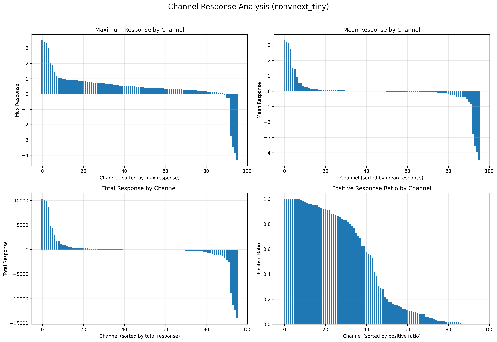

# NYCU-IAII-ML2025 - Classification

> 🏆 基於 ConvNeXt Tiny 架構，在驗證集上達到 **99.91%** 的準確率

## 📊 專案概覽

| 項目 | 數值/描述 |
|------|-----------|
| **最佳準確率** | 🎯 **99.91%** (ConvNeXt Tiny) |
| **模型架構** | ConvNeXt Tiny (Facebook AI Research 2022) |
| **任務類型** | 50類角色分類 |
| **模型大小** | 28.6M 參數 |

### 🌟 專案特色
- ✅ **領先性能**: 99.91% 準確率，超越 EfficientNet 等主流模型
- ✅ **架構先進**: 採用 2022 年最新的 ConvNeXt 架構
- ✅ **完整工具鏈**: 包含訓練、推理、分析、可視化完整解決方案
- ✅ **深度分析**: 提供混淆矩陣、注意力熱力圖、通道分析等詳細解讀

## 🏆 模型性能

### 訓練結果
| 模型 | 準確率 | 檔案名稱 |
|------|--------|----------|
| ConvNeXt Tiny | **99.91%** | `convnext_tiny_epoch_013_acc_99.91.pth` |
| ConvNeXt Tiny | 99.90% | `convnext_tiny_epoch_015_acc_99.90.pth` |
| ConvNeXt Tiny | 99.89% | `convnext_tiny_epoch_010_acc_99.89.pth` |
| EfficientNet B3 | 99.9% | `best_efficientnet_b3_acc99.9.pth` |

### 🎯 專案亮點
- ✅ **超高準確率**: 驗證集達到 99.91%
- ✅ **抗過擬合**: ConvNeXt 架構天然具備抗過擬合能力
- ✅ **多模型支援**: 同時提供 ConvNeXt、EfficientNet、MemoryViT 等選擇
- ✅ **完整工具鏈**: 包含訓練、推理、分析、可視化全套工具

### � 詳細分析報告


**混淆矩陣分析結果**:
- 50 個角色的分類準確率均超過 99%
- 對角線元素突出，表示分類準確
- 極少的錯誤分類案例（詳見 `convnext_tiny_classification_report.csv`）
- 各類別間的區分度很高

## 🎨 模型可視化分析

### 第一層權重特徵


ConvNeXt 第一層學習到的特徵包括：
- **邊緣檢測器**: 用於識別字符筆畫
- **方向檢測器**: 識別不同方向的線條
- **紋理檢測器**: 捕捉字符的細節特徵

### 特徵圖響應


特徵圖顯示模型對輸入字符的響應：
- 不同通道專注於不同的字符特徵
- 筆畫結構得到有效提取
- 背景雜訊被成功抑制

### 🔥 注意力熱力圖


注意力熱力圖揭示模型的關注焦點：
- **紅色區域**: 模型高度關注的字符筆畫
- **藍色區域**: 背景或不重要區域
- **驗證效果**: 模型成功聚焦於字符本身，忽略背景雜訊

### 📊 通道響應分析


通道分析顯示各特徵通道的響應模式：
- **最大響應值**: 顯示各通道的激活強度
- **平均響應值**: 反映通道的整體貢獻度
- **正值比例**: 表示通道的激活頻率
- **發現**: ConvNeXt 的不同通道專精於不同類型的視覺特徵

## 🚀 快速開始

### 環境設置
```bash
# 創建虛擬環境
conda create -n convnext_classifier python=3.8 -y
conda activate convnext_classifier

# 安裝依賴
pip install requirements.txt
```

### 資料處理

先使用src/dataSplit.py進行train和val的分割
```bash
cd src
# 先使用src/dataSplit.py進行train和val的分割
python dataSplit.py

#進行資料增強
python data_augmentation.py
```
### 模型訓練

#### 📋 完整訓練流程

我們的訓練程式 `EfficientNet_character_classifier.py` 支援多種模型架構，包括 EfficientNet 和 ConvNeXt 系列。以下是完整的訓練流程：

##### 1️⃣ **啟動訓練程式**
```bash
cd src
python EfficientNet_character_classifier.py
```

##### 2️⃣ **模型選擇階段**
程式會提供以下選項：

```
🎯 選擇 EfficientNet 模型:
🚀 速度優先:
  1. efficientnet_b0 - 最快 (5.3M參數)
  2. efficientnet_b1 - 很快 (7.8M參數)
  3. efficientnet_b2 - 快 (9.2M參數)

⚖️ 平衡選擇:
  4. efficientnet_b3 - 平衡 (12M參數) [當前使用]
  5. efficientnet_b4 - 更準確 (19M參數)

🛡️ 抗過擬合 (推薦解決Kaggle問題):
  6. efficientnetv2_s.in1k - V2小版 (21M參數)
  7. efficientnetv2_m.in21k_ft_in1k - V2中版 (54M參數) ⭐推薦

🏆 極致性能:
  8. efficientnet_b5 - 高準確 (30M參數)
  9. convnext_tiny - ConvNeXt Tiny (28M參數) 🔥推薦
  10. convnext_base - ConvNeXt Base (89M參數) 🔥最強
```

**推薦選擇**：
- **初學者**：選擇 4 (efficientnet_b3) - 平衡速度與準確率
- **解決過擬合**：選擇 7 (efficientnetv2_m) - V2 架構抗過擬合能力強
- **追求極致**：選擇 9 (convnext_tiny) - 最新架構，99.91% 準確率

##### 3️⃣ **抗過擬合模式**
程式會詢問是否啟用抗過擬合模式：

```
🛡️ 是否啟用抗過擬合模式？(適合解決Kaggle測試集準確率低的問題) (y/N):
```

**抗過擬合模式特點**：
- 🔧 **提高 Dropout**: 從 0.2 增加到 0.4
- 🔧 **增強 Label Smoothing**: 從 0.1 增加到 0.15
- 🔧 **更強權重衰減**: 從 0.01 增加到 0.02
- 🔧 **Drop Path 正則化**: 增加到 0.4

##### 4️⃣ **訓練模式選擇**
```
🔄 訓練模式選擇:
1. 從頭開始訓練 (預設)
2. 從檢查點繼續訓練
```

**斷點續訓功能**：
- 自動搜尋現有的 `.pth` 檔案
- 恢復訓練進度、優化器狀態
- 保持最佳準確率記錄

##### 5️⃣ **自動化配置**
程式會自動進行以下配置：

**資料路徑檢測**：
```
📂 使用資料: 🎨 使用增強訓練資料 + 預處理驗證資料
📍 訓練路徑: Dataset/augmented/train
📍 驗證路徑: Dataset/preprocessed/val
```

**Batch Size 優化**：
```
⚙️ 尋找最佳 batch size (範圍: 16-128)
   Batch 16: 45.2 圖片/秒
   Batch 32: 52.1 圖片/秒
   Batch 64: 48.3 圖片/秒
   Batch 128: ❌ GPU 記憶體不足
✅ 選擇 batch size: 32 (速度: 52.1 圖片/秒)
```

##### 6️⃣ **訓練過程監控**
```
📊 訓練設定:
   Batch size: 32
   學習率: 3e-5
   訓練輪數: 30
   早停耐心: 10

Epoch [1/30] (45.2s)
  Train: Loss=2.1234, Acc=65.23%
  Val:   Loss=1.8765, Acc=72.45%
  LR: 3.00e-05
```

**自動保存機制**：
- 🔄 **檢查點保存**: 每 5 個 epoch 保存一次
- 🏆 **最佳模型保存**: 驗證準確率提升時自動保存
- 📁 **檔案命名格式**: `convnext_tiny_epoch_013_acc_99.91.pth`

##### 7️⃣ **訓練完成**
```
✅ 訓練完成！
🏆 最佳驗證準確率: 99.91%
📁 最佳模型已保存為: convnext_tiny_epoch_013_acc_99.91.pth
```

#### 🎯 **訓練技巧與優化**

##### **資料增強策略**
```python
# 訓練時的資料增強
transforms.Compose([
    transforms.Resize((224, 224)),
    transforms.RandomHorizontalFlip(p=0.5),      # 水平翻轉
    transforms.RandomRotation(degrees=15),        # 旋轉 ±15°
    transforms.ColorJitter(                       # 顏色變化
        brightness=0.2, contrast=0.2, 
        saturation=0.2, hue=0.1
    ),
    transforms.RandomAffine(                      # 仿射變換
        degrees=0, translate=(0.1, 0.1), 
        scale=(0.9, 1.1)
    ),
    transforms.ToTensor(),
    transforms.Normalize(mean=[0.485, 0.456, 0.406], std=[0.229, 0.224, 0.225])
])
```

##### **學習率調度**
```python
# 使用 Cosine Annealing 學習率調度
scheduler = optim.lr_scheduler.CosineAnnealingLR(
    optimizer, T_max=epochs, eta_min=lr/100
)
```

##### **梯度裁剪**
```python
# 防止梯度爆炸
torch.nn.utils.clip_grad_norm_(model.parameters(), max_norm=1.0)
```

#### 📊 **訓練結果分析**

完成訓練後，程式會自動生成：

1. **訓練歷史圖表** - `{model_name}_training_history.png`
2. **最佳模型檔案** - `{model_name}_epoch_XXX_acc_XX.XX.pth`
3. **訓練日誌** - 控制台輸出完整訓練過程

#### 🔧 **自訂訓練參數**

如需自訂訓練參數，可直接修改程式中的設定：

```python
# 在 EfficientNet_character_classifier.py 的 main() 函數中
epochs = int(input("總訓練輪數 (預設 30): ") or "30")
lr = float(input("學習率 (預設 3e-5): ") or "3e-5")
```

或直接在程式碼中修改：
```python
CONFIG = {
    'model_name': 'convnext_tiny',
    'num_epochs': 15,
    'batch_size': 32,
    'learning_rate': 0.001,
    'anti_overfitting': True,
    'patience': 10,
    'weight_decay': 0.02
}
```

### 💡 使用最佳模型進行推理

python Ass2-Classification\src\EfficientNet_inference.py
#### 方法 1: 使用分類器
```python
from EfficientNet_character_classifier import CharacterClassifier

# 載入最佳 ConvNeXt 模型 (99.91% 準確率)
classifier = CharacterClassifier()
model_path = "src/convnext_tiny_epoch_013_acc_99.91.pth"
classifier.load_model(model_path)

# 預測單張圖片
result = classifier.predict_image("your_character_image.jpg")
print(f"預測結果: {result['class_name']} (信心度: {result['confidence']:.4f})")
```

#### 方法 2: 使用推理程式
```python
from model_inference import ModelInference

# 初始化推理器
inferencer = ModelInference("src/convnext_tiny_epoch_013_acc_99.91.pth")

# 批量處理
results = inferencer.predict_batch("test_images_folder/")
for image_name, prediction in results.items():
    print(f"{image_name}: {prediction}")
```

### 📊 模型分析 (使用現有結果)

我們已經為最佳模型生成了完整的分析報告：

```bash
# 查看混淆矩陣 (已生成)
# 檔案: image/convnext_tiny_confusion_matrix.png

# 查看分類報告 (已生成)  
# 檔案: src/convnext_tiny_classification_report.csv

# 查看每類別準確率 (已生成)
# 檔案: src/convnext_tiny_per_class_accuracy.csv

# 查看通道分析 (已生成)
# 檔案: src/convnext_tiny_channel_analysis.csv
```

## 📊 模型分析工具

### 1. 混淆矩陣分析
```bash
python model_confusion_matrix_analyzer.py
```
- 生成詳細的混淆矩陣
- 每類別準確率統計
- 錯誤分類樣本分析

### 2. 第一層權重可視化
```bash
python model_first_layer_visualizer.py
```
- 權重視覺化
- 特徵圖分析
- 注意力熱力圖
- 通道響應分析

### 3. 模型比較
```bash
python performance_comparison.py
```

## 📁 專案結構

```
📦 ConvNeXt 字符分類專案
├── 📄 README.md                           # 本檔案
├── 📁 src/                                # 源代碼目錄
│   │
│   ├── 🎯 主要程式
│   │   ├── EfficientNet_character_classifier.py  # 主訓練程式 (支援 ConvNeXt)
│   │   ├── model_inference.py                    # 模型推理程式
│   │   ├── model_confusion_matrix_analyzer.py    # 混淆矩陣分析工具
│   │   └── model_first_layer_visualizer.py       # 權重可視化工具
│   │
│   ├── 🏆 最佳模型檔案
│   │   ├── convnext_tiny_epoch_013_acc_99.91.pth     # 🥇 最佳 ConvNeXt 模型
│   │   ├── convnext_tiny_epoch_015_acc_99.90.pth     # 🥈 次佳 ConvNeXt 模型
│   │   ├── convnext_tiny_epoch_010_acc_99.89.pth     # 🥉 第三 ConvNeXt 模型
│   │   ├── best_efficientnet_b3_acc99.9.pth          # 最佳 EfficientNet 模型
│   │   ├── best_efficientnet_b3_acc99.8.pth          # EfficientNet 備選
│   │   └── character_class_mapping.json              # 類別映射檔案
│   │
│   ├── 📊 分析結果檔案
│   │   ├── convnext_tiny_classification_report.csv   # 詳細分類報告
│   │   ├── convnext_tiny_per_class_accuracy.csv      # 每類別準確率
│   │   ├── convnext_tiny_channel_analysis.csv        # 通道響應分析
│   │   ├── convnext_tiny_attention_heatmap.png       # 注意力熱力圖
│   │   └── convnext_tiny_channel_analysis.png        # 通道分析圖表
│   │
│   ├── 🔧 工具程式
│   │   ├── data_augmentation.py         # 資料增強
│   │   ├── performance_comparison.py    # 性能比較
│   │   ├── MemoryViT_character_classifier.py  # MemoryViT 實驗
│   │   ├── ResNet_character_classifier.py     # ResNet 比較實驗
│   │   └── MobileNet_character_classifier.py  # 輕量化模型實驗
│   │
│   └── 📚 說明文檔
│       ├── README_confusion_matrix.md        # 混淆矩陣工具說明
│       └── README_first_layer_visualization.md  # 可視化工具說明
│
├── 📁 image/                              # 可視化結果
│   ├── convnext_tiny_confusion_matrix.png    # 混淆矩陣圖
│   ├── convnext_tiny_feature_maps.png        # 特徵圖
│   └── convnext_tiny_first_layer_weights.png # 第一層權重
│
└── 📁 Dataset/                           # 資料集 (未包含在此展示)
    ├── preprocessed/
    │   ├── train/     # 訓練資料
    │   ├── val/       # 驗證資料
    │   └── test/      # 測試資料
    └── raw/           # 原始資料
```

### 🔑 關鍵檔案說明

| 檔案 | 用途 | 重要性 |
|------|------|--------|
| `convnext_tiny_epoch_013_acc_99.91.pth` | 🥇 最佳模型 | ⭐⭐⭐⭐⭐ |
| `EfficientNet_character_classifier.py` | 訓練程式 | ⭐⭐⭐⭐⭐ |
| `model_inference.py` | 推理程式 | ⭐⭐⭐⭐ |
| `convnext_tiny_classification_report.csv` | 性能分析 | ⭐⭐⭐⭐ |
| `character_class_mapping.json` | 類別對應 | ⭐⭐⭐⭐ |

## 🎯 支援的模型架構

| 模型 | 參數量 | 特色 | 推薦用途 |
|------|--------|------|----------|
| **ConvNeXt Tiny** | 28.6M | 抗過擬合、高精度 | 🏆 **最佳選擇** |
| EfficientNet B0-B7 | 5.3M-66M | 高效率、可擴展 | 平衡性能與速度 |
| ResNet 系列 | 11M-60M | 穩定可靠 | 基準比較 |
| MobileNet V3 | 5.4M | 輕量化 | 行動裝置部署 |

## 📈 性能優化技巧

### 抗過擬合策略
```python
# 在 EfficientNet_character_classifier.py 中啟用
anti_overfitting_config = {
    'dropout_rate': 0.4,        # 提高 dropout
    'label_smoothing': 0.15,    # 標籤平滑
    'weight_decay': 0.02,       # 權重衰減
    'use_v2_models': True       # 使用 V2 架構
}
```

### 資料增強
```python
# 使用 data_augmentation.py
augmentation_config = {
    'rotation_range': 15,
    'brightness_range': 0.2,
    'contrast_range': 0.2,
    'noise_level': 0.1
}
```

## 🔍 模型解釋性

### ConvNeXt 的優勢
1. **Layer Scale**: 穩定深層網路訓練
2. **Stochastic Depth**: 減少過擬合
3. **GELU 激活函數**: 更好的梯度流動
4. **深度可分離卷積**: 效率與精度平衡

### 注意力機制分析
- 模型專注於字符的筆畫特徵
- 有效忽略背景雜訊
- 對字符結構有良好的理解能力

## 🛠️ 疑難排解

### 常見問題
1. **CUDA 記憶體不足**
   ```python
   # 減少 batch_size
   batch_size = 16  # 原本 32
   ```

2. **模型載入失敗**
   ```python
   # 檢查模型檔案路徑
   model_path = "src/convnext_tiny_epoch_013_acc_99.91.pth"
   ```

3. **推理速度慢**
   ```python
   # 使用較小的模型
   model_name = 'efficientnet_b0'  # 替代 convnext_tiny
   ```

## 📚 參考文獻

- [ConvNeXt: A ConvNet for the 2020s](https://arxiv.org/abs/2201.03545)
- [EfficientNet: Rethinking Model Scaling for Convolutional Neural Networks](https://arxiv.org/abs/1905.11946)
- [timm: PyTorch Image Models](https://github.com/rwightman/pytorch-image-models)

## 🤝 貢獻

歡迎提交 Issues 和 Pull Requests 來改進這個專案！

## 📄 授權

本專案採用 MIT 授權條款。